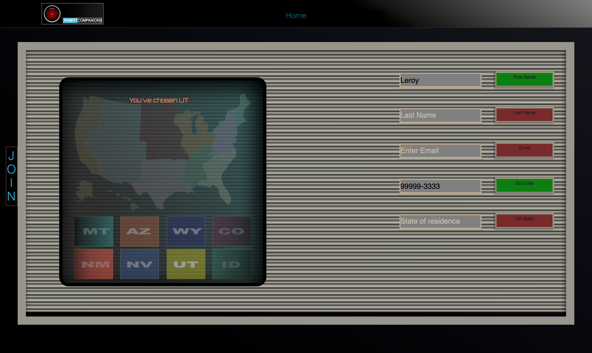

# 2-Page-App

## Feature-set

|<h3>Feature</h3>|<h3>Notes</h3>|<h3>Status</h3>|
|:-----------|:-------|:-------|
|**Slider**|handcoded|***√***|
|**Responsivity**|media queries|***iPad,iPhone7,8,X(with some sizing problems),GalaxyS5***|
|**Layout**|CSS Grid|***√***|
|**CSS Reset**|Normalize|***√***|
|**Authentification**|npm-validator|***√***|
|**React**|16.0.0|***√***|
|**Webpack**|watch/web-server|***√***|
|**babel-core**|env,react|***√***|
|**Routes**|one(plus one for components)|***√***|
|**TabIndex Attrs**|a-tags and btns|*Pending*|

## Ambitions for this project:

+ A new styled approach to the (United States) drop-down.
+ No CSS file. As a proof of concept, I want to do a first website without a css file.
  This would challenge me to exploit the nature of StyledComponents and theming.
*This does come at a cost of the CSS being parsed twice both by css parser and by the javascript*
+ Executing audio with the signup page as a short UX response to valid & invalid inputs by the user.

## Further improvements to be made
+ scrnshot to cover the gifs to simulate playbuttons
+ landscape breakpoints for iphones. --> Now, they look pretty awful.
+ reworking of the color palette and typography.
+ uglification
+ normalize
+ prep data inputs for back-end storage.
+ HOSTING!

## Last day TODOS

+ port signup to retro signup  √
+ consider buttons with labels for states that appear upon region click √
+ replace acronyms with full names of regions in "monitor" --(rejected... went with other design)
+ folder tree for each region √
+ comment critical code.√
+ glitch animation on monitor? --Only if there's time...

## CLI commands

+ yarn run build

# Notes, Context & some features

This coding challenge was simply to clone the general style of the following website & to add a second page with
user validation
First Name
Last Name (with dashes and apostrophes)
email
US zipcode
US States Dropdown

[Doosan Baseball](http://baseball.doosan.com/)

In the spirit of trying to to leave a place nicer than when I found it, I was ambitious to add a bit while
not doing too much damage :).

## Highlights

### Slider

I saw the carousel and (while it wasn't part of the challenge) I thought "Hey... how hard could it be?".

After a few tears & swears... works.

It has nowhere near the functionality that Owl-Carousel plugin has (that the original site uses), but I managed a quick and dirty & *very* light-weight slider.

The whole point of not using a library was to make it lightweight and functional.
I met my goal & am happy

...but it's a bicycle--not a Lexus.

I was as ambitious to do a youtube API... but I didn't want to get too into the weeds with trying to do something impressive--while missing the core points of the coding that was requested which was sign-up and user validation.

This lead me to the choice of theme/content.

### The content

It's risky to make this decision, but I simply wanted people to smile when they visit.

The cost comes at having delivered a *non*-generic feel to the site I've built. 

(Only Lorem Ipsum was requested, for instance--so, perhaps any content change--at all--is undesirable).

Confession... I simply couldn't help myself. In order to go on and dive as deeply as I have, I've had 'create' a kind of passion for it.

Anyway... The result is something with a theme of "shitty-robots". The Hero video is taken from videos done by a woman who works in robotics and is brilliant & funny.

The heaviest cost is, of course, the page-weight.

I wanted to give a kind of sinister--but--satirical feel to the idea of AI and the coming "robo-pocalypse"...

I really dislike the look of drop-downs and have often felt that websites use such a dull way to get info from the user.

The signup should be welcoming and fun, I think.

Engagement ought to be engaging.

So instead of this:
test1

test2
 -->
test3

